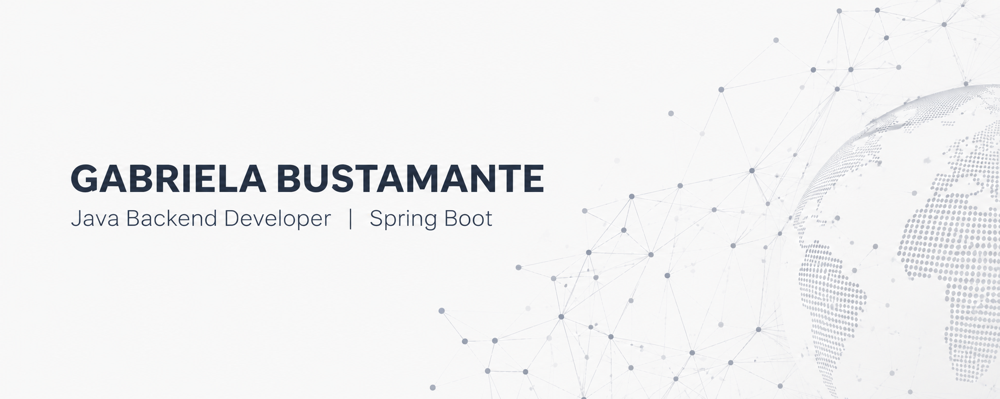

Soy Desarrolladora Backend especializada en el ecosistema **Java**. Mi enfoque está orientado al diseño de APIs REST robustas, la implementación de arquitecturas limpias y la integración de capas de seguridad sólidas en las aplicaciones. 

Cuento con experiencia práctica colaborando en proyectos reales de código abierto y plataformas sectoriales como **Tu-Mtch** y **BusConnect**, donde aplico estándares modernos de desarrollo y buenas prácticas de ingeniería de software.

### 🛠️ Tecnologías y Habilidades Fuertes:
   

### 🗄️ Gestión de Datos y Persistencia:
  

### 🚀 Herramientas y Entorno de Desarrollo:
      

### 🧪 Calidad de Código y Testing:
   

### 🎯 Mi Enfoque Profesional:
Busco incorporarme a equipos de desarrollo dinámicos donde pueda aportar mi compromiso con el código limpio, la seguridad y las metodologías ágiles. Me entusiasma enfrentarme a desafíos de lógica backend complejos y seguir evolucionando mis competencias en arquitecturas escalables y sistemas distribuidos.

### ✉️ ¿Hablamos?
 

### 🌱 Fuera del código:
* Me apasiona el aprendizaje continuo y asumir nuevos retos intelectuales. 📚
* Entusiasta del entrenamiento de fuerza y el gimnasio. 💪
* Amante de la naturaleza y los animales. 🐾

